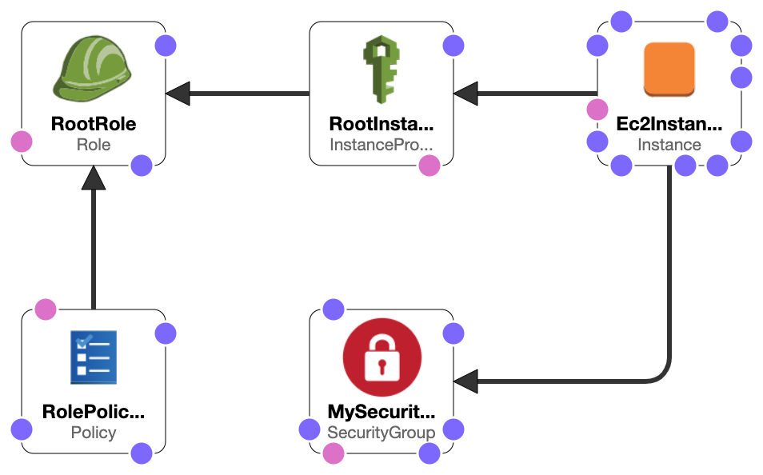

# Synthea-Generator-CloudFormation-Template

# Description

This is a simple AWS CloudFormation template that will create as stack that will generate a synthetic set of patients using Synthea Patient Generator tool.
This template takes advantage of Infrastructure-as-service paradigm to provide infrastructure functionality through simple code implementation.

# Important notes
## Regions
The stack has been designed to work in the following AWS US regions:
- us-east-1
- us-east-2
- us-west-1
- us-west-2
For addition regions augment the region/ami-id map:
Mappings:
  RegionMap:
    \&lt;region\&gt;:
    AMI: \&lt;ami-id\&gt;

## Stack deletion
The user should delete the stack manfully upon task completion (stack done).
The stack doesn&#39;t shut down itself and if left in place resources will be consumed (see the hourly price for the desired ec2 instance).

# Usage
AWS console  
By using "create stack" UI functionality.  
IMPORTANT: don't forget to check "I acknowledge that AWS CloudFormation might create IAM resources." in Capabilities section at the very end.
AWS CLI example   
aws cloudformation create-stack --stack-name my-synthea-stack-01 --template-body file://../synthea-patient-generation-template-v02.yaml --parameters ParameterKey=InstanceTypeAndSize,ParameterValue=t2.medium  ParameterKey=KeyName,ParameterValue=<YOUR-KEY-PAIR> ParameterKey=MySyntheaConfigurationFile,ParameterValue=s3://<URI-FOR-SYNTHEA-PROPERTY-FILE> ParameterKey=MySyntheaGnerationParameters,ParameterValue="-s 21 -p 10 " ParameterKey=MySyntheaPopulationOutput,ParameterValue=s3://<URI-FOR-SYNTHEA-OUTPUT> --capabilities CAPABILITY_IAM   

# Input
Stack name – a name for the stack to be created

## Parameters
### InstanceTypeAndSize
AWS Instance type and size to be used for deploying Synthea. From my experience, Synthea requires at least 4GB memory. Please see [https://aws.amazon.com/ec2/instance-types/](https://aws.amazon.com/ec2/instance-types/)
Default: t2.medium

### KeyName
An existing key pair needs to exist or to be generated and used to SSH into the EC2 instance.
The key pair is necessary only if need/want to connect to the ec2 instance. The stack should create the cohort and put it at the location defined below without the need to ssh. In conclusion one doesn&#39;t need to ssh into the created instance/
For details https://docs.aws.amazon.com/AWSEC2/latest/UserGuide/ec2-key-pairs.html

### MySyntheaConfigurationFile
The location of Synthea configuration file. Please set a configuration file as per need using
[https://github.com/synthetichealth/synthea/wiki/Common-Configuration](https://github.com/synthetichealth/synthea/wiki/Common-Configuration)
An example file is committed in example-configuration directory.

### MySyntheaGnerationParameters
Please read (look for example parameters) https://github.com/synthetichealth/synthea/blob/master/README.md. ATTENTION: ENTER ONLY THE PARAMETERS - DO NOT ENTER run\_syntea part
Examples: [https://github.com/synthetichealth/synthea](https://github.com/synthetichealth/synthea)

### MySyntheaPopulationOutput
The S3 location (bucket/path) where Synthea generated population will be output.

# Infrastructure (stack) created
The following blueprint represents the resources created.

The ec2 instance will:
- install java, git
- clone the repo from [https://github.com/synthetichealth/synthea.git](https://github.com/synthetichealth/synthea.git)
- replace the default Synthea configuration file with the one specified by the user
- run Synthea based on the set of parameters
- copy Synthea output to the location specified by the user
